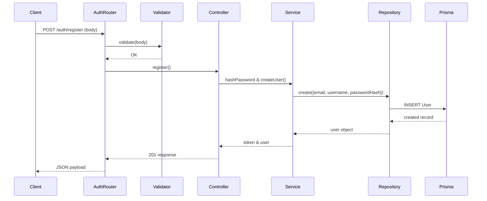

# Module 1 — Identity & Platform API Contracts

This module documents the **Identity & Platform** endpoints that are part of the MVP.

---

## Authentication Endpoints

### `POST /auth/register`
* **Purpose**: Register a new platform user.
* **Authentication**: None (public).
* **Authorization**: Public.
* **Request Body**:
```json
{
  "email": "user@example.com",
  "username": "user123",
  "password": "StrongPass!23"
}
```
* **Validation**:
  - `email`: must be a valid email and unique.
  - `username`: 3‑50 alphanumeric characters.
  - `password`: minimum 8 characters, at least one uppercase, number, and special character.
* **Response (201 Created)**:
```json
{
  "success": true,
  "message": "User registered successfully",
  "data": {
    "user": {
      "id": "<uuid>",
      "email": "user@example.com",
      "username": "user123",
      "createdAt": "<timestamp>"
    }
  }
}
```

### `POST /auth/login`
* **Purpose**: Authenticate a user and issue a JWT.
* **Authentication**: None (public).
* **Authorization**: Public.
* **Request Body**:
```json
{
  "email": "user@example.com",
  "password": "StrongPass!23"
}
```
* **Response (200 OK)**:
```json
{
  "success": true,
  "message": "Login successful",
  "data": {
    "token": "<jwt>",
    "user": { "id": "<uuid>", "email": "...", "username": "..." }
  }
}
```
* **JWT Payload**: `{ "userId": "<user uuid>" }`

### `GET /auth/profile`
* **Purpose**: Retrieve the authenticated user's profile.
* **Authentication**: Required (Bearer JWT).
* **Authorization**: Public (any authenticated user).
* **Response (200 OK)**:
```json
{
  "success": true,
  "message": "Profile retrieved",
  "data": { "user": { "id": "...", "email": "...", "username": "..." } }
}
```

---

## Business Rules & Validation
* Passwords are hashed with **bcrypt** (cost factor 10) before storage.
* Emails are unique (`@@unique([email])`).
* JWTs are signed with `process.env.JWT_SECRET` and expire after **7 days**.
* The authentication middleware extracts `userId` from the token and attaches `req.user = { userId }` for downstream use.

---

## Layer Responsibilities
| Layer | File(s) | Responsibility |
|------|----------|----------------|
| **Routes** | `src/routes/auth.routes.js` | Declare endpoints, attach validation middleware. |
| **Validators** | `src/validators/auth.validator.js` | Zod schemas for register & login payloads. |
| **Controllers** | `src/controllers/auth.controller.js` | Translate HTTP request to service calls, format responses. |
| **Services** | `src/services/auth.service.js` | Business logic: password hashing, credential verification, JWT generation. |
| **Repositories** | `src/repositories/auth.repository.js` | Prisma queries for `User` (create, findByEmail). |
| **Middleware** | `src/middleware/authenticate.middleware.js` | JWT verification, attach `req.user`. |

---

## Verification Status
* **Unit Tests** (`test-auth.js`) cover registration, duplicate email, successful login, invalid credentials, profile access (with/without token).
* **Integration Tests** run the full Express stack – all pass.
* **Prisma validation** (`npx prisma validate`) succeeds.

---

## Sequence Diagram (Registration)


---

**All endpoints are functional and documented.**
