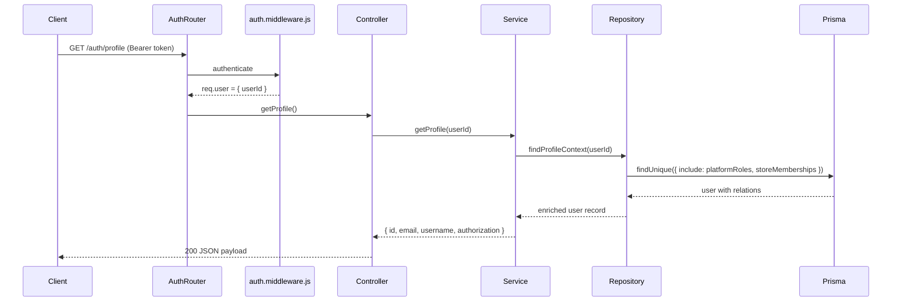

# Authentication Module Documentation

This document describes the authentication subsystem of the E‑Com Lite backend.

---

## Overview
The authentication layer provides user registration, login, profile retrieval, and JWT-based session handling. All passwords are secure, hashed using bcrypt.

To maximize efficiency and security:
* **Identical Authorization Context**: Both the login (`POST /auth/login`) and profile retrieval (`GET /auth/profile`) endpoints return the **identical user authorization context** (platform role and store memberships). This ensures the frontend immediately knows the user's roles upon authentication, eliminating any need for an immediate follow-up profile request.
* **Minimal Session Token**: The JWT remains minimal, storing only `{ userId }`. Platform roles, permissions, and memberships are resolved on the backend dynamically on each request rather than being serialized in the token.
* **Authorization Authority**: The backend is the single source of truth for authorization. The frontend must never infer access rights from email, username, IDs, or endpoint probing.

---

## API Endpoints

### `POST /auth/register`
* **Purpose**: Create a new user account.
* **Request Body**:
  ```json
  {
    "email": "user@example.com",
    "username": "user123",
    "password": "StrongPass!23"
  }
  ```
* **Validation**:
  - `email`: valid email format, unique.
  - `username`: 3‑50 characters.
  - `password`: minimum 6 characters.
* **Response (201 Created)**:
  ```json
  {
    "success": true,
    "message": "User registered successfully",
    "data": {
      "user": {
        "id": "uuid",
        "email": "user@example.com",
        "username": "user123",
        "createdAt": "timestamp"
      }
    }
  }
  ```

### `POST /auth/login`
* **Purpose**: Authenticate a user and issue a JWT. Returns the full authorization context alongside the token so the frontend immediately knows the user's role without a separate follow-up request.
* **Request Body**:
  ```json
  {
    "email": "user@example.com",
    "password": "StrongPass!23"
  }
  ```
* **Response (200 OK)**:
  ```json
  {
    "success": true,
    "message": "User logged in successfully",
    "data": {
      "token": "<jwt>",
      "user": {
        "id": "uuid",
        "email": "user@example.com",
        "username": "user123",
        "createdAt": "timestamp",
        "updatedAt": "timestamp",
        "authorization": {
          "platformRole": "SUPER_ADMIN",
          "storeMemberships": [
            {
              "storeId": "store-uuid",
              "storeName": "My Electronics Store",
              "storeSlug": "my-electronics-store",
              "roleName": "STORE_OWNER"
            }
          ]
        }
      }
    }
  }
  ```
* **JWT Payload**:
  ```json
  { "userId": "<user uuid>" }
  ```

### `GET /auth/profile`
* **Purpose**: Retrieve the authenticated user's full profile including their **authorization context**. Returns the same user shape as `POST /auth/login`. The backend is the single source of truth for authorization; clients must base all role-aware UI decisions on this response.
* **Authentication**: Required (Bearer JWT).
* **Response (200 OK)**:
  ```json
  {
    "success": true,
    "message": "User profile retrieved successfully",
    "data": {
      "user": {
        "id": "uuid",
        "email": "user@example.com",
        "username": "user123",
        "createdAt": "timestamp",
        "updatedAt": "timestamp",
        "authorization": {
          "platformRole": "SUPER_ADMIN",
          "storeMemberships": [
            {
              "storeId": "store-uuid",
              "storeName": "My Electronics Store",
              "storeSlug": "my-electronics-store",
              "roleName": "STORE_OWNER"
            }
          ]
        }
      }
    }
  }
  ```

#### Authorization Context Fields — both `POST /auth/login` and `GET /auth/profile`

| Field | Type | Description |
|---|---|---|
| `authorization.platformRole` | `string \| null` | The user's platform-level role name (e.g. `SUPER_ADMIN`). `null` when the user holds no platform role. |
| `authorization.storeMemberships` | `array` | All stores the user is a member of. Empty array `[]` when the user has no memberships. |
| `authorization.storeMemberships[].storeId` | `string` | UUID of the store. |
| `authorization.storeMemberships[].storeName` | `string` | Display name of the store. |
| `authorization.storeMemberships[].storeSlug` | `string` | URL slug of the store. |
| `authorization.storeMemberships[].roleName` | `string` | The user's role name in this store (e.g. `STORE_OWNER`, `STORE_STAFF`). |

#### Client Usage Rules

- Use `platformRole === 'SUPER_ADMIN'` to show or hide platform admin UI.
- Use `storeMemberships` to determine which stores the user can manage and in what capacity.
- **Never** inspect `email`, `username`, or any other field for authorization decisions.
- **Never** enumerate permissions on the frontend. Permission enforcement is exclusively the backend's responsibility via RBAC middleware.

---

## Business Rules & Validation
* **Unified Login Flow** – Only one login system/page exists. Both platform administrators (`SUPER_ADMIN`) and store tenants authenticate through this single shared flow. There is no separate admin login page.
* Email uniqueness enforced at the Prisma level (`@@unique([email])`).
* Passwords are never stored in plain text — hashed with `bcrypt` using a cost factor of 10.
* JWTs are signed with `process.env.JWT_SECRET` and expire after `process.env.JWT_EXPIRES_IN`.
* The JWT payload contains only `{ userId }`. Authorization data is never embedded in the token.
* The authentication middleware extracts `userId` from the token and attaches `req.user = { userId }` for downstream middleware and controllers.

---

## Layer Responsibilities
| Layer | Responsibility |
|------|-----------------|
| **Routes** (`src/routes/auth.routes.js`) | Declare endpoint paths and attach middleware (validation, authentication). |
| **Validators** (`src/validators/auth.validator.js`) | Zod schemas for request body validation. |
| **Controllers** (`src/controllers/auth.controller.js`) | Convert Express request to service calls, return formatted success/error responses. |
| **Services** (`src/services/auth.service.js`) | Business logic: password hashing, credential verification, JWT generation, authorization context assembly. |
| **Repositories** (`src/repositories/user.repository.js`) | Direct Prisma queries for `User` model. `findById` for basic lookups. `findProfileContext` for the enriched authenticated profile query. |

---

## Verification Status
* **Unit Tests**: `test-auth.js` — covers successful registration, duplicate email rejection, successful login, invalid credential handling, profile access with/without token, and authorization context fields in profile response.
* **Integration Tests**: Run through the full Express stack — all tests pass.
* **Prisma Validation**: Schema validated (`npx prisma validate`).

---

## Sequence Diagram (Profile with Authorization Context)


---

**Verification**: All endpoints are functional, documented, and covered by automated tests.
