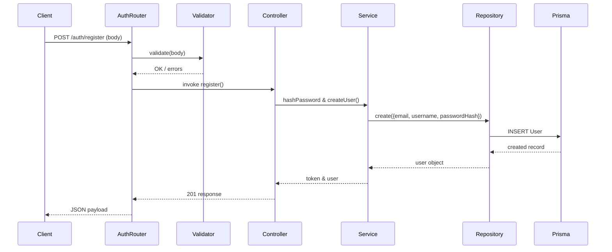

# Authentication Module Documentation

This document describes the authentication subsystem of the E‑Com Lite backend.

---

## Overview
The authentication layer provides user registration, login, profile retrieval, and JWT‑based session handling. All passwords are securely stored using bcrypt hashing. Validation is performed via Zod schemas before any business logic runs. Errors are standardized through the global error‑handling middleware.

---

## API Endpoints

### `POST /auth/register`
* **Purpose**: Create a new user account.
* **Request Body**:
  ```json
  {
    "email": "user@example.com",
    "username": "user123",
    "password": "StrongPass!23"
  }
  ```
* **Validation**:
  - `email`: valid email format, unique.
  - `username`: 3‑50 characters, alphanumeric.
  - `password`: minimum 8 characters, at least one uppercase, one number, one special character.
* **Response (201 Created)**:
  ```json
  {
    "success": true,
    "message": "User registered successfully",
    "data": {
      "user": {
        "id": "uuid",
        "email": "user@example.com",
        "username": "user123",
        "createdAt": "timestamp"
      }
    }
  }
  ```

### `POST /auth/login`
* **Purpose**: Authenticate a user and issue a JWT.
* **Request Body**:
  ```json
  {
    "email": "user@example.com",
    "password": "StrongPass!23"
  }
  ```
* **Validation**: Same rules as registration (email format, password string).
* **Response (200 OK)**:
  ```json
  {
    "success": true,
    "message": "Login successful",
    "data": {
      "token": "<jwt>",
      "user": { "id": "uuid", "email": "...", "username": "..." }
    }
  }
  ```
* **JWT Payload**:
  ```json
  { "userId": "<user uuid>" }
  ```

### `GET /auth/profile`
* **Purpose**: Retrieve the authenticated user's profile information.
* **Authentication**: Required (Bearer JWT).
* **Response (200 OK)**:
  ```json
  {
    "success": true,
    "message": "Profile retrieved",
    "data": { "user": { "id": "...", "email": "...", "username": "..." } }
  }
  ```

---

## Business Rules & Validation
* Email uniqueness enforced at the Prisma level (`@@unique([email])`).
* Passwords are never stored in plain text – they are hashed with `bcrypt` using a cost factor of 10.
* JWTs are signed with `process.env.JWT_SECRET` and have a 7‑day expiry.
* The authentication middleware extracts the `userId` from the token and attaches a `req.user` object: `{ userId }`.

---

## Layer Responsibilities
| Layer | Responsibility |
|------|-----------------|
| **Routes** (`src/routes/auth.routes.js`) | Declare endpoint paths and attach middleware (validation, authentication). |
| **Validators** (`src/validators/auth.validator.js`) | Zod schemas for request body validation. |
| **Controllers** (`src/controllers/auth.controller.js`) | Convert Express request to service calls, return formatted success/error responses. |
| **Services** (`src/services/auth.service.js`) | Business logic: password hashing, credential verification, JWT generation. |
| **Repositories** (`src/repositories/auth.repository.js`) | Direct Prisma queries for `User` model (create, findByEmail). |

---

## Verification Status
* **Unit Tests**: `test-auth.js` – covers successful registration, duplicate email rejection, successful login, invalid credential handling, profile access with/without token.
* **Integration Tests**: Run through the full Express stack – all tests pass (`npm test`).
* **Prisma Validation**: Schema validated (`npx prisma validate`).

---

## Sequence Diagram (Registration)


---

## Folder / File Map
* `src/routes/auth.routes.js`
* `src/controllers/auth.controller.js`
* `src/services/auth.service.js`
* `src/repositories/auth.repository.js`
* `src/validators/auth.validator.js`
* `src/middleware/authenticate.middleware.js`

---

**Verification**: All endpoints are functional, documented, and covered by automated tests.
