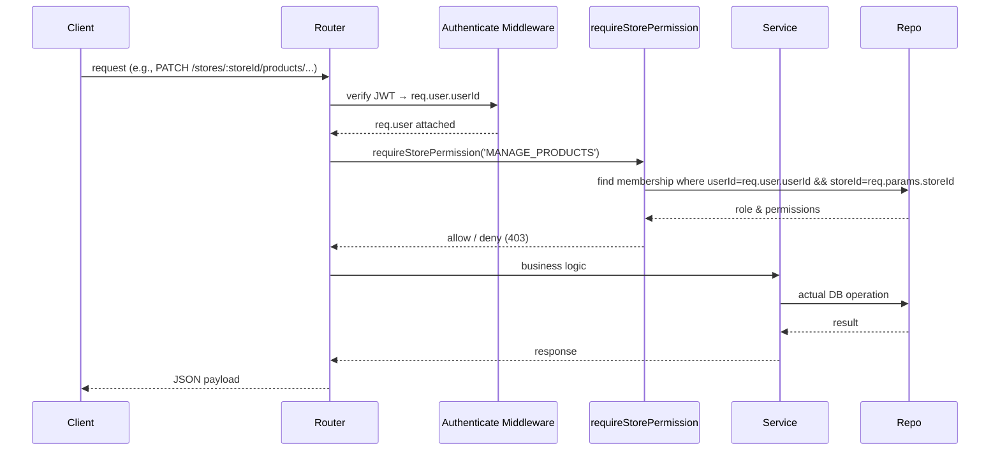

# Platform RBAC Documentation

This document captures the role‑based access control (RBAC) implementation for both the **platform** and **store** layers.

---

## Core Concepts
* **Platform Roles** – Global roles that apply across the entire system (e.g., `SUPER_ADMIN`).
* **Platform Permissions** – High‑level actions such as `MANAGE_USERS`, `VIEW_ALL_STORES`.
* **Store Roles** – Roles scoped to a particular store (`STORE_OWNER`, `STORE_STAFF`).
* **Store Permissions** – Store‑specific actions like `MANAGE_PRODUCTS`, `MANAGE_CATEGORIES`, `VIEW_STORE_DASHBOARD`.
* **Permission Middleware** – `requireStorePermission(permission)` validates the caller’s membership in the target store and checks the required permission.
* **Context‑based Authorization** – The request’s `storeId` (extracted from the path) defines the authorization context; no other sources (headers, query, body) are consulted.

---

## Data Model (Prisma)
```prisma
model Role {
  id          String   @id @default(uuid())
  name        String   @unique
  permissions Permission[] @relation("RolePermissions")
}

model Permission {
  id   String @id @default(uuid())
  name String @unique
}

model StoreRole {
  id          String   @id @default(uuid())
  name        String   @unique
  permissions Permission[] @relation("StoreRolePermissions")
}

model UserStoreMembership {
  id        String   @id @default(uuid())
  userId    String
  storeId   String
  roleId    String   // references StoreRole
  // computed many‑to‑many through join table
}
```
* Platform roles/permissions are seeded during the initial migration.
* Store roles are linked to a user via `UserStoreMembership` which also stores the `storeId` to enforce tenant isolation.

---

## Permission Resolution Flow

* The middleware rejects the request with **403 Forbidden** if the permission is missing.

---

## Business Rules
* **Never** resolve store context from request headers, query strings, or bodies – it is always the path parameter `storeId`.
* Store permissions are **strictly additive**; a user may hold multiple store roles.
* Platform permissions **cannot** be used to access store‑scoped resources.
* The `SUPER_ADMIN` platform role bypasses store permission checks for admin‑only endpoints (e.g., store approval).

---

## Verification Status
* **Unit Tests** (`test-rbac.js`): covers permission grant, denial, cross‑store isolation, and platform‑vs‑store boundary.
* **Integration Tests**: exercised through the full request stack – all RBAC checks behave as expected.
* **Prisma Validation**: schema compiled without errors; unique constraints on role/permission names enforced.

---

## Folder / File Map
| Layer | Path |
|------|------|
| Routes | `src/routes/**` (store‑scoped routes call `requireStorePermission`) |
| Middleware | `src/middleware/rbac.middleware.js` |
| Services | Any service that mutates store data (product, inventory, category) invokes the middleware via route definition. |
| Repositories | Pure Prisma queries – no permission logic.

---

**Verification**: All RBAC flows are covered by automated tests and manual smoke checks.
