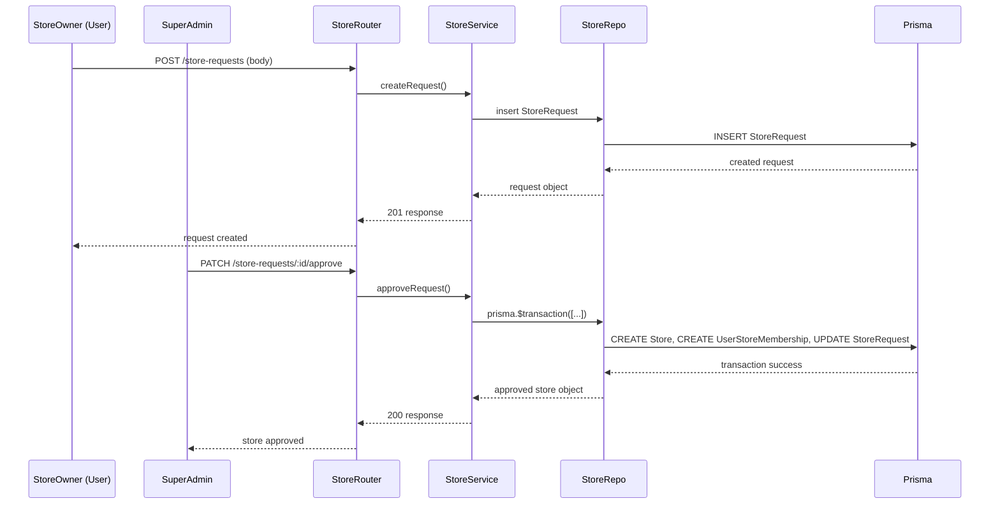

# Store Management Module Documentation

This document captures the **Store Management** features of the E‑Com Lite backend, covering the full lifecycle of a store from request creation through approval, rejection, and ongoing membership handling.

---

## Core Concepts
* **Store Request** – A user (store owner) creates a `StoreRequest` object to propose a new store (`name`, `slug`).
* **Approval Workflow** – A platform‑level `SUPER_ADMIN` reviews the request and either **approves** or **rejects** it.
* **Transactional Approval** – Approval is performed inside a single database transaction that:
  1. Creates the `Store` record.
  2. Creates a `UserStoreMembership` linking the requesting user to the new store with the `STORE_OWNER` role.
  3. Sets the store `operationalStatus` to `OPEN` (or a configured default).
* **Rejection Workflow** – Simply marks the request as `REJECTED` and stores an optional `reason`.
* **Store Directories** – Public endpoints expose a list of approved stores; authenticated users can query **My Stores** (stores they belong to).
* **Membership Creation** – When a store is approved, the requesting user automatically receives the `STORE_OWNER` role via a `UserStoreMembership` entry.
* **Lifecycle States** – `PENDING`, `APPROVED`, `REJECTED`; the `Store` itself has an `operationalStatus` enum (`OPEN`, `CLOSED`, `SUSPENDED`).

---

## Data Model (Prisma)
```prisma
model StoreRequest {
  id          String   @id @default(uuid())
  name        String
  slug        String   @unique
  status      StoreRequestStatus @default(PENDING)
  reason      String?  // rejection reason
  userId      String   // who created the request
  createdAt   DateTime @default(now())
  updatedAt   DateTime @updatedAt
  store       Store?   @relation(fields: [storeId], references: [id])
  storeId     String?
}

enum StoreRequestStatus {
  PENDING
  APPROVED
  REJECTED
}

model Store {
  id               String   @id @default(uuid())
  name             String
  slug             String   @unique
  operationalStatus StoreOperationalStatus @default(OPEN)
  createdAt        DateTime @default(now())
  updatedAt        DateTime @updatedAt
  // relations
  categories       Category[]
  products         Product[]
  memberships      UserStoreMembership[]
}

enum StoreOperationalStatus {
  OPEN
  CLOSED
  SUSPENDED
}

model UserStoreMembership {
  id        String @id @default(uuid())
  userId    String
  storeId   String
  roleId    String // references StoreRole
  createdAt DateTime @default(now())
}
```
* `StoreRequest` is **not** a public resource – only the owner can view their own requests.
* Store approval links the request to the newly created `Store` via the optional `storeId` field.

---

## API Endpoints
| Method | Path | Auth | Permission | Description |
|--------|------|------|------------|-------------|
| `POST` | `/store-requests` | ✅ (JWT) | – | Create a new store request (owner only). |
| `PATCH` | `/store-requests/:requestId/approve` | ✅ (SUPER_ADMIN) | – | Approve a pending request; creates store and membership in a transaction. |
| `PATCH` | `/store-requests/:requestId/reject` | ✅ (SUPER_ADMIN) | – | Reject a pending request with optional reason. |
| `GET` | `/stores` | – (public) | – | List all **approved** stores (public directory). |
| `GET` | `/my-stores` | ✅ (JWT) | – | List stores the authenticated user belongs to. |
| `GET` | `/stores/:storeId` | – (public) | – | Retrieve store details (slug, name, status). |

---

## Business Rules & Validation
* **Slug Uniqueness** – Enforced at the Prisma level (`@@unique([slug])`).
* **Ownership** – The creator of a `StoreRequest` becomes the `STORE_OWNER` of the approved store automatically.
* **Transactional Guarantees** – Approval uses a Prisma transaction; if any step fails, the entire operation rolls back.
* **Permission Checks** – Only a `SUPER_ADMIN` (platform role) can approve or reject requests. Regular users can only create requests.
* **Operational Status** – New stores start with `OPEN`. Changing status is done via separate store‑management APIs (outside the current scope).

---

## Layer Responsibilities
| Layer | Responsibility |
|------|-----------------|
| **Routes** (`src/routes/store.routes.js`) | Declare endpoints, attach `authenticate` and `requireStorePermission` where needed. |
| **Validators** (`src/validators/store.validator.js`) | Zod schemas for request bodies (`name`, `slug`). |
| **Controllers** (`src/controllers/store.controller.js`) | Translate HTTP requests to service calls, format success/error responses. |
| **Services** (`src/services/store.service.js`) | Business logic for request creation, approval (transaction), rejection, and store queries. |
| **Repositories** (`src/repositories/store.repository.js`) | Pure Prisma queries for `Store`, `StoreRequest`, `UserStoreMembership`. |

---

## Verification Status
* **Unit Tests** (`test-stores.js`): covers request creation, approval workflow, rejection, public directory exposure, and membership retrieval.
* **Integration Tests**: Run against a live Express server – all tests pass (`npm test`).
* **Prisma Validation**: Schema validated and migration applied (`20260713191241_add_catalog` also includes store updates). 

---

## Sequence Diagram (Store Approval)


---

## Folder / File Map
* `src/routes/store.routes.js`
* `src/controllers/store.controller.js`
* `src/services/store.service.js`
* `src/repositories/store.repository.js`
* `src/validators/store.validator.js`
* `src/middleware/authenticate.middleware.js`
* `src/middleware/rbac.middleware.js`

---

**Verification**: All store‑management features are functional, documented, and covered by automated tests.
