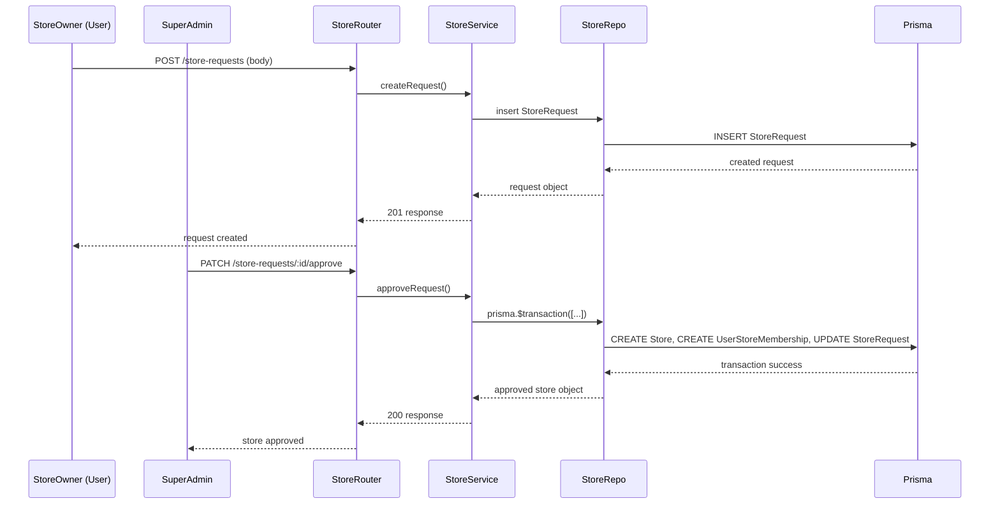

# Store Management Module Documentation

This document captures the **Store Management** features of the E‑Com Lite backend, covering the full lifecycle of a store from request creation through approval, rejection, and ongoing membership handling.

---

## Core Concepts
* **Store Request** – A user (store owner) creates a `StoreRequest` object to propose a new store (`name`, `slug`).
* **Approval Workflow** – A platform‑level `SUPER_ADMIN` reviews the request and either **approves** or **rejects** it.
* **Transactional Approval** – Approval is performed inside a single database transaction that:
  1. Creates the `Store` record.
  2. Creates a `UserStoreMembership` linking the requesting user to the new store with the `STORE_OWNER` role.
  3. Sets the store `operationalStatus` to `OPEN` (or a configured default).
* **Rejection Workflow** – Simply marks the request as `REJECTED` and stores an optional `reason`.
* **Store Directories** – Public endpoints expose a list of approved stores; authenticated users can query **My Stores** (stores they belong to).
* **Membership Creation** – When a store is approved, the requesting user automatically receives the `STORE_OWNER` role via a `UserStoreMembership` entry.
* **Lifecycle States** – `PENDING`, `APPROVED`, `REJECTED`; the `Store` itself has an `operationalStatus` enum (`OPEN`, `CLOSED`, `SUSPENDED`).

---

## Data Model (Prisma)
```prisma
model StoreRequest {
  id          String             @id @default(uuid())
  name        String
  slug        String
  description String?
  avatarUrl   String?            @map("avatar_url")
  status      StoreRequestStatus @default(PENDING)
  userId      String             @map("user_id")
  storeId     String?            @unique @map("store_id")
  createdAt   DateTime           @default(now()) @map("created_at")
  updatedAt   DateTime           @updatedAt @map("updated_at")

  user  User   @relation(fields: [userId], references: [id], onDelete: Cascade)
  store Store? @relation(fields: [storeId], references: [id], onDelete: SetNull)

  @@map("store_requests")
}

enum StoreRequestStatus {
  PENDING
  APPROVED
  REJECTED
  NEEDS_CHANGES
}

model Store {
  id                String                 @id @default(uuid())
  name              String
  slug              String                 @unique
  description       String?
  avatarUrl         String?                @map("avatar_url")
  approvalStatus    StoreApprovalStatus    @default(PENDING) @map("approval_status")
  operationalStatus StoreOperationalStatus @default(CLOSED) @map("operational_status")
  createdAt         DateTime               @default(now()) @map("created_at")
  updatedAt         DateTime               @updatedAt @map("updated_at")

  memberships  UserStoreMembership[]
  storeRequest StoreRequest?
  categories   Category[]
  products     Product[]

  @@map("stores")
}

model UserStoreMembership {
  id        String   @id @default(uuid())
  userId    String   @map("user_id")
  storeId   String   @map("store_id")
  roleId    String   @map("role_id")
  createdAt DateTime @default(now()) @map("created_at")
  updatedAt DateTime @updatedAt @map("updated_at")

  user  User      @relation(fields: [userId], references: [id], onDelete: Cascade)
  store Store     @relation(fields: [storeId], references: [id], onDelete: Cascade)
  role  StoreRole @relation(fields: [roleId], references: [id], onDelete: Restrict)

  @@unique([userId, storeId])
  @@map("user_store_memberships")
}
```
* `StoreRequest` is **not** a public resource – only the owner can view their own requests.
* Store approval links the request to the newly created `Store` via the optional `storeId` field.

---

## API Endpoints
| Method | Path | Auth | Permission | Description |
|--------|------|------|------------|-------------|
| `POST` | `/store-requests` | ✅ (JWT) | – | Create a new store request (owner only). |
| `PATCH` | `/store-requests/:requestId/approve` | ✅ (SUPER_ADMIN) | `APPROVE_STORE` | Approve a pending request; creates store and membership in a transaction. |
| `PATCH` | `/store-requests/:requestId/reject` | ✅ (SUPER_ADMIN) | `APPROVE_STORE` | Reject a pending request with optional reason. |
| `GET` | `/stores/platform` | ✅ (SUPER_ADMIN) | `APPROVE_STORE` | List **all** stores on the platform (all `operationalStatus` and `approvalStatus` values). |
| `GET` | `/stores` | – (public) | – | List all **approved** stores (public directory). |
| `GET` | `/stores/my` | ✅ (JWT) | – | List stores the authenticated user belongs to. |
| `GET` | `/stores/:storeId` | – (public) | – | Retrieve store details (slug, name, status). |

---

## Business Rules & Validation
* **Slug Uniqueness** – Enforced at the Prisma level (`@@unique([slug])`).
* **Ownership** – The creator of a `StoreRequest` becomes the `STORE_OWNER` of the approved store automatically.
* **Transactional Guarantees** – Approval uses a Prisma transaction; if any step fails, the entire operation rolls back.
* **Permission Checks** – Only a `SUPER_ADMIN` (platform role) can approve or reject requests. Regular users can only create requests.
* **Platform Store Directory & Discovery** – Listing all stores on the platform is strictly a Platform Administration feature. Only `SUPER_ADMIN` platform users can access the Platform Store Directory; regular tenants and customers cannot browse all stores. Regular users discover stores exclusively through the public storefront.
* **Public Storefront** – Public storefront remains completely public and does not require authentication. It serves as the primary and only discovery mechanism for non-admin users.
* **Store Registration Request Details (Approved Future Scope)** – Store requests will be expanded to include:
  - Store Name
  - Store Slug
  - Description
  - Store Avatar (placeholder input in UI, inactive until backend file upload is implemented in a future milestone)
* **Store Settings (Approved Future Scope)** – Once a store request is approved, the merchant-facing "Request Store" page converts to a "Store Settings" dashboard. Here, the Store Admin manages metadata including Store Name, Description, Avatar image, and other future business details.
* **Store Deletion & Recovery (Approved Future Workflow)** – The architecture includes provisions for Store Soft Delete and Store Recovery:
  - Store Settings contains a prominent section allowing a Store Admin to request deletion.
  - When deletion is requested, the backend flags the store as soft-deleted (`isDeleted` / `deletedAt`).
  - Soft-deleted stores are filtered out from public storefront listings and normal tenant directory queries.
  - The Platform Store Directory continues to return all stores, including soft-deleted ones, to support administrative audits and recovery.
  - Store Recovery is a future workflow (managed via a "Recover Store" dashboard in Platform Admin) that clears the deletion flag, restoring the store's operational status.
  - Currently, soft delete and recovery are **not yet implemented** in the codebase. Therefore, the directory currently returns all stores on the platform because no deletion logic exists in the database schema or repository.
* **Theme Support (Approved Future Scope)** – The frontend architecture supports Dark Mode and Light Mode theme toggle controls.
* **Platform Store Directory Query** – Returns stores of all `operationalStatus` (OPEN, CLOSED, SUSPENDED) and `approvalStatus` (PENDING, APPROVED, REJECTED, NEEDS_CHANGES) values. Protected by the `APPROVE_STORE` platform permission.
* **Operational Status** – New stores start with `OPEN`. Changing status is done via separate store‑management APIs (outside the current scope).

---

## Layer Responsibilities
| Layer | Responsibility |
|------|-----------------|
| **Routes** (`src/routes/store.routes.js`) | Declare endpoints, attach `authenticate` and `requireStorePermission` where needed. |
| **Validators** (`src/validators/store.validator.js`) | Zod schemas for request bodies (`name`, `slug`). |
| **Controllers** (`src/controllers/store.controller.js`) | Translate HTTP requests to service calls, format success/error responses. |
| **Services** (`src/services/store.service.js`) | Business logic for request creation, approval (transaction), rejection, and store queries. |
| **Repositories** (`src/repositories/store.repository.js`) | Pure Prisma queries for `Store`, `StoreRequest`, `UserStoreMembership`. |

---

## Verification Status
* **Unit Tests** (`test-stores.js`): covers request creation, approval workflow, rejection, public directory exposure, and membership retrieval.
* **Integration Tests**: Run against a live Express server – all tests pass (`npm test`).
* **Prisma Validation**: Schema validated and migration applied (`20260713191241_add_catalog` also includes store updates). 

---

## Sequence Diagram (Store Approval)


---

## Folder / File Map
* `src/routes/store.routes.js`
* `src/controllers/store.controller.js`
* `src/services/store.service.js`
* `src/repositories/store.repository.js`
* `src/validators/store.validator.js`
* `src/middleware/authenticate.middleware.js`
* `src/middleware/rbac.middleware.js`

---

**Verification**: All store‑management features are functional, documented, and covered by automated tests.
