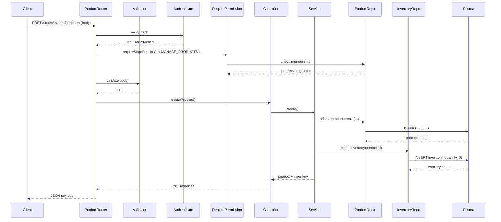

# Catalog Module Documentation

This document details the **Catalog** subsystem of the E‑Com Lite backend, covering Categories and Products and their interactions.

---

## Core Concepts
* **Category** – A store‑scoped grouping for products. Each category belongs to a single store and has a unique `slug` per store.
* **Product** – An item for sale within a store. A product may optionally belong to a category (`categoryId` is nullable).
* **SetNull Deletion** – Deleting a category does **not** delete its products; instead the `categoryId` on affected products is set to `NULL`.
* **Store‑scoped Operations** – All catalog endpoints are nested under `/stores/:storeId/...`. The `storeId` path parameter is the sole source of tenant context.

---

## Data Model (Prisma)
```prisma
model Category {
  id        String   @id @default(uuid())
  name      String
  slug      String
  storeId   String
  store     Store    @relation(fields: [storeId], references: [id])
  products  Product[]
  createdAt DateTime @default(now())
  updatedAt DateTime @updatedAt
  @@unique([storeId, slug])
}

model Product {
  id          String   @id @default(uuid())
  name        String
  description String?
  price       Decimal  @db.Decimal(10, 2)
  imageUrls   String[]
  storeId     String
  store       Store    @relation(fields: [storeId], references: [id])
  categoryId  String?  // optional
  category    Category? @relation(fields: [categoryId], references: [id], onDelete: SetNull)
  inventory   Inventory?
  createdAt   DateTime @default(now())
  updatedAt   DateTime @updatedAt
}
```
* Category `slug` uniqueness is enforced per store.
* Product `categoryId` is **nullable** – the relation uses `onDelete: SetNull` to retain products when a category is removed.
* A one‑to‑one `Inventory` relation is defined on `Product` (see Inventory documentation).

---

## API Endpoints (summary – see full contracts in `07‑api‑contracts.md`)
| Method | Path | Auth | Permission | Description |
|--------|------|------|------------|-------------|
| `POST` | `/stores/:storeId/categories` | ✅ (JWT) | `MANAGE_PRODUCTS` | Create a new category. |
| `GET`  | `/stores/:storeId/categories` | – (public) | – | List categories for a store. |
| `PATCH`| `/stores/:storeId/categories/:id` | ✅ (JWT) | `MANAGE_PRODUCTS` | Update a category (name/slug). |
| `DELETE`| `/stores/:storeId/categories/:id` | ✅ (JWT) | `MANAGE_PRODUCTS` | Delete a category – products retain with `categoryId` set to `NULL`. |
| `POST` | `/stores/:storeId/products` | ✅ (JWT) | `MANAGE_PRODUCTS` | Create product (auto‑creates inventory). |
| `GET`  | `/stores/:storeId/products` | – (public) | – | List all products (optional `categoryId` filter). |
| `GET`  | `/stores/:storeId/products/:id` | – (public) | – | Retrieve product details (includes category & inventory). |
| `PATCH`| `/stores/:storeId/products/:id` | ✅ (JWT) | `MANAGE_PRODUCTS` | Update product fields (including setting `categoryId` to `null`). |
| `DELETE`| `/stores/:storeId/products/:id` | ✅ (JWT) | `MANAGE_PRODUCTS` | Delete product (cascades inventory). |

---

## Validation Rules (Zod – `src/validators/catalog.validator.js`)
* **Category**
  - `name`: string, 3‑50 characters.
  - `slug`: string, lowercase alphanumeric + hyphens, unique per store.
* **Product**
  - `name`: string, 3‑100 characters.
  - `description`: optional string.
  - `price`: positive decimal (>= 0).
  - `imageUrls`: optional array of valid URLs.
  - `categoryId`: optional UUID – must belong to the same `storeId` if provided.

---

## Business Rules
* **Tenant Isolation** – `storeId` taken from the URL path; no other source is used to resolve store context.
* **Category Slug Uniqueness** – Enforced by Prisma composite unique index `[storeId, slug]`.
* **Optional Category** – Products may be created without a category; `categoryId` may be set to `null` to detach.
* **SetNull on Deletion** – When a category is deleted, Prisma automatically sets `categoryId` on related products to `NULL`; products remain visible.
* **Permission Requirement** – All mutating actions (`POST`, `PATCH`, `DELETE`) require the `MANAGE_PRODUCTS` store permission.
* **Automatic Inventory Creation** – Upon product creation the service layer creates a linked `Inventory` record with `quantity = 0`.

---

## Layer Responsibilities
| Layer | Files (example) | Responsibility |
|------|----------------|----------------|
| **Routes** | `src/routes/category.routes.js`, `src/routes/product.routes.js` | Declare endpoints, mount with `{ mergeParams: true }`, attach middleware (auth, RBAC, validation). |
| **Validators** | `src/validators/catalog.validator.js` | Zod schemas for category and product payloads. |
| **Controllers** | `src/controllers/category.controller.js`, `src/controllers/product.controller.js` | Thin HTTP glue – extract params, call services, format responses. |
| **Services** | `src/services/category.service.js`, `src/services/product.service.js` | Business logic: ownership checks, slug uniqueness verification, automatic inventory creation, SetNull handling. |
| **Repositories** | `src/repositories/category.repository.js`, `src/repositories/product.repository.js` | Pure Prisma queries – `create`, `findMany`, `update`, `delete`, plus relational includes. |

---

## Verification Status
* **Unit Tests** – `test-catalog.js` covers category CRUD, product CRUD, slug uniqueness, optional category, SetNull behavior, permission enforcement.
* **Integration Tests** – Run against a live server; all scenarios pass (`npm test`).
* **Prisma Validation** – Schema passes `prisma validate` and migrations applied (`20260713191241_add_catalog`).

---

## Sequence Diagram (Create Product with Inventory)


---

## Folder / File Map
* `src/routes/category.routes.js`
* `src/routes/product.routes.js`
* `src/controllers/category.controller.js`
* `src/controllers/product.controller.js`
* `src/services/category.service.js`
* `src/services/product.service.js`
* `src/repositories/category.repository.js`
* `src/repositories/product.repository.js`
* `src/validators/catalog.validator.js`

---

**Verification**: All catalog features are fully implemented, documented, and covered by automated tests.
