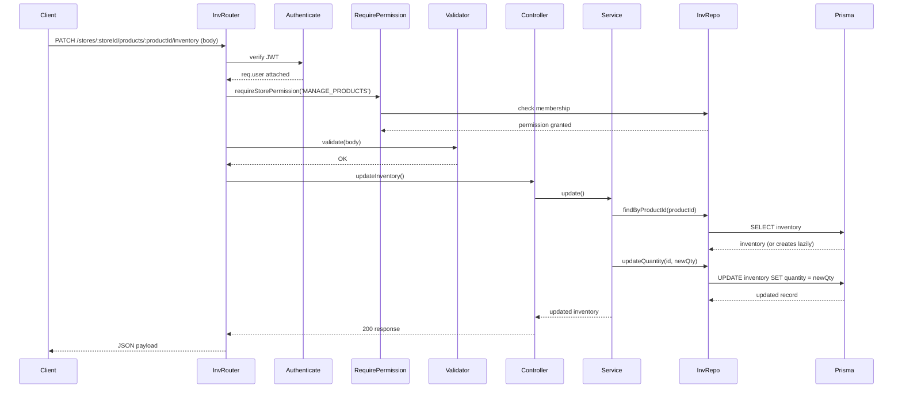

# Inventory Module Documentation

This document captures the **Inventory Foundation** (Milestone M2.2) implementation details, covering the data model, API contracts, business rules, validation, and layer responsibilities.

---

## Core Concepts
* **Inventory** – Tracks the stock quantity of a single product within a store.
* **One‑to‑One Relation** – Every `Product` has exactly one associated `Inventory` record.
* **Automatic Creation** – When a product is created, an `Inventory` entry with `quantity = 0` is created automatically in the same transaction.
* **Lazy‑Creation Fallback** – If an existing product lacks an inventory record (legacy data), the repository will create a new inventory entry on‑the‑fly with quantity 0.
* **Store‑Scoped Validation** – The `storeId` path parameter is the sole source of tenant context; inventory updates are allowed only for products belonging to that store.

---

## Data Model (Prisma)
```prisma
model Inventory {
  id        String   @id @default(uuid())
  productId String   @unique
  product   Product  @relation(fields: [productId], references: [id], onDelete: Cascade)
  quantity  Int      @default(0)
  createdAt DateTime @default(now())
  updatedAt DateTime @updatedAt
}

// Product already contains:
//   inventory   Inventory?
```
* `onDelete: Cascade` ensures that deleting a product automatically removes its inventory.
* `quantity` is a non‑negative integer – enforced at the application layer via validation.

---

## API Endpoints (see full contracts in `07‑api‑contracts.md`)
| Method | Path | Auth | Permission | Description |
|--------|------|------|------------|-------------|
| `GET`  | `/stores/:storeId/products/:productId/inventory` | – (public) | – | Retrieve the current stock quantity for a product. |
| `PATCH`| `/stores/:storeId/products/:productId/inventory` | ✅ (JWT) | `MANAGE_PRODUCTS` | Update the stock quantity for a product (must belong to the same store). |

---

## Validation Rules (Zod – `src/validators/inventory.validator.js`)
* **Quantity** – Must be an integer `>= 0`.
* **Payload** – `{ "quantity": <non‑negative integer> }`.
* The validator is applied in the route before the controller is invoked.

---

## Business Rules
* **Tenant Isolation** – The service validates that the requested `productId` belongs to the `storeId` supplied in the URL. Cross‑store updates are rejected with `403 Forbidden`.
* **Permission Requirement** – Updating inventory requires the `MANAGE_PRODUCTS` store permission; retrieval is public.
* **Non‑Negative Quantity** – Negative quantities are rejected (`400 Bad Request`).
* **Lazy Creation** – When `GET /inventory` is called for a product lacking an inventory record, the repository creates one with quantity 0 and returns it.

---

## Layer Responsibilities
| Layer | Files (example) | Responsibility |
|------|----------------|----------------|
| **Routes** | `src/routes/inventory.routes.js` | Declare GET and PATCH endpoints, mount with `{ mergeParams: true }`, attach `authenticate` and `requireStorePermission('MANAGE_PRODUCTS')` for PATCH. |
| **Validators** | `src/validators/inventory.validator.js` | Zod schema ensuring `quantity` is a non‑negative integer. |
| **Controllers** | `src/controllers/inventory.controller.js` | Extract params, call service methods, format success/error responses. |
| **Services** | `src/services/inventory.service.js` | Verify store‑product relationship, enforce business rules, delegate to repository. |
| **Repositories** | `src/repositories/inventory.repository.js` | Prisma queries: `findByProductId` (with lazy‑creation fallback) and `updateQuantity`. |
| **Middleware** | `src/middleware/authenticate.middleware.js`, `src/middleware/rbac.middleware.js` | Authentication & permission enforcement (PATCH only). |

---

## Verification Status
* **Automated Test Suite** (`test-inventory.js`) validates:
  1. Public inventory retrieval (defaults to 0).
  2. Authorized store owner can update quantity.
  3. Regular user blocked (403).
  4. Cross‑store update blocked (403).
  5. Negative quantity rejected (400).
  6. Database cleanup succeeds.
* All tests pass (`npm test`).
* **Prisma Validation** – Schema passes `prisma validate`; migration `20260713193311_add_inventory` applied successfully.

---

## Sequence Diagram (Update Inventory)


---

## Folder / File Map
* `src/routes/inventory.routes.js`
* `src/controllers/inventory.controller.js`
* `src/services/inventory.service.js`
* `src/repositories/inventory.repository.js`
* `src/validators/inventory.validator.js`
* `src/middleware/authenticate.middleware.js`
* `src/middleware/rbac.middleware.js`

---

**Verification**: All inventory features are functional, documented, and covered by automated tests.
