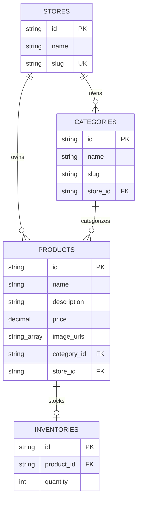

# Catalog & Inventory Database Design

This document details the database schema layout, indexes, constraints, and relationships for the Category, Product, and Inventory models in the E-Com Lite system.

---

## Entity Relationship Diagram

---

## Schema Tables

### 1. `categories` Table
Stores product category structures scoped by tenant.
* **Fields**:
  - `id`: `TEXT` (UUID), Primary Key.
  - `name`: `TEXT`, Category display name.
  - `slug`: `TEXT`, URL slug.
  - `store_id`: `TEXT` (UUID), Foreign Key referencing `stores(id)`.
  - `created_at`: `TIMESTAMP`, Defaults to current time.
  - `updated_at`: `TIMESTAMP`, Automatically updates.
* **Relationships**:
  - Scoped to one `Store` (On Store deletion, Category is cascade deleted).
* **Constraints**:
  - `@@unique([store_id, slug])`: Slugs are unique per store context.

### 2. `products` Table
Stores product listings.
* **Fields**:
  - `id`: `TEXT` (UUID), Primary Key.
  - `name`: `TEXT`, Product name.
  - `description`: `TEXT` (Nullable), Optional product description.
  - `price`: `DECIMAL(10, 2)`, Monetarily precise price value.
  - `image_urls`: `TEXT[]` (Array), String array of image resource links.
  - `category_id`: `TEXT` (UUID, Nullable), Foreign Key referencing `categories(id)`.
  - `store_id`: `TEXT` (UUID), Foreign Key referencing `stores(id)`.
  - `created_at`: `TIMESTAMP`, Defaults to current time.
  - `updated_at`: `TIMESTAMP`, Automatically updates.
* **Relationships**:
  - Scoped to one `Store` (On Store deletion, Product is cascade deleted).
  - Optionally belongs to one `Category`.
* **Constraints**:
  - `onDelete: SetNull` on `category_id`: Deleting a category sets `category_id` to `NULL` for associated products, ensuring product listings remain active.

### 3. `inventories` Table
Tracks stock quantities for products.
* **Fields**:
  - `id`: `TEXT` (UUID), Primary Key.
  - `product_id`: `TEXT` (UUID), Foreign Key referencing `products(id)`, Unique.
  - `quantity`: `INTEGER`, Current stock level, Defaults to `0`.
  - `created_at`: `TIMESTAMP`, Defaults to current time.
  - `updated_at`: `TIMESTAMP`, Automatically updates.
* **Relationships**:
  - Mapped one-to-one to a `Product`.
* **Constraints**:
  - `onDelete: Cascade` on `product_id`: Deleting a product automatically deletes its inventory entry.
  - `quantity >= 0`: Enforced at runtime by the application logic and validator layers (must be a non-negative integer).
  - Scoped under the tenant's context via the product's associated `store_id` (cross-store queries are forbidden).
